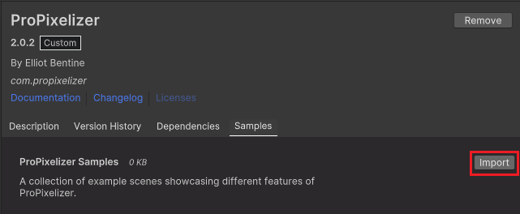

+++
title = "See the examples"
weight = 3
date = 2024-10-19
+++

  
Here you can explore the sample scenes included with ProPixelizer. Each one focuses on a practical technique you can inspect, adapt, and use in your own Unity project.

  <aside class="examples-import-callout" aria-label="Import information">
    
These samples are <strong>included with ProPixelizer,</strong> you can import every scene from the Package Manager.

    <a href="#import-samples">View import steps ↓</a>
  </aside>

  


Applies pixelization and color grading to the whole camera. URP's postprocessing is used to give a feeling of depth.



A quick example to confirm your installation is correct.



Compare silhouette outlines, edge highlights and lit bevel edges.



Eliminate pixel creep from moving objects.



Maintain a consistent pixel size across different camera zooms and screen resolutions.



Explore color palettes and dither patterns. ProPixelizer contains tools for creating your own dither patterns and palettes.



Restrict sub-pixel motion between related objects, such as equipment attached to a character.



Apply ProPixelizer to different cameras within a URP camera stack.



ProPixelizer supports both Forward and Forward+ for virtually unlimited additional lights.


  

  <section class="examples-install-guide" id="import-samples">
    

      <h2>Import the sample scenes</h2>
      
In Unity's Package Manager, choose <code>Packages: In Project</code>, select <code>ProPixelizer</code>, open the <code>Samples</code> tab, and select <code>Import</code>. Each scene includes a readme in its hierarchy with setup notes and further suggestions.

    

    <figure>
      
      <figcaption>The Samples tab in Unity's Package Manager.</figcaption>
    </figure>
  </section>

