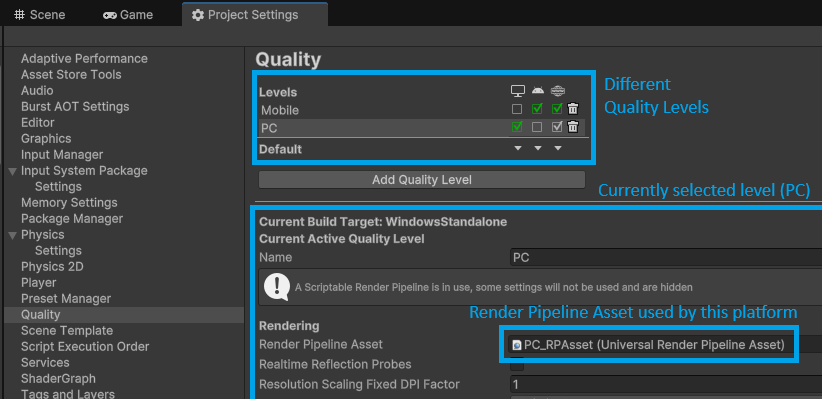
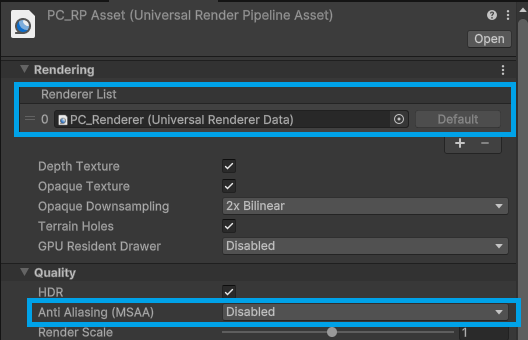
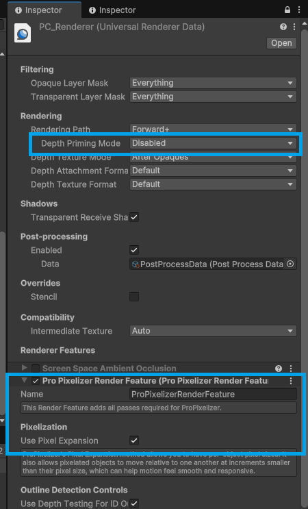

+++
title = "Quick Start"
description = "Quick Start"
weight = 2
date= 2024-10-19
+++

Make sure you have the Universal Render Pipeline package added to the project (if not, you can add this using the Unity Package Manager). 

# 1. Import ProPixelizer

Import ProPixelizer from the Unity Package Manager; it must be located at Assets/ProPixelizer, which is the default location Unity suggests.

# 2. Find your Render Pipeline Asset(s)

Universal Render Pipeline stores your project's graphical configuration in a Render Pipeline Asset.
These assets are commonly stored in Assets/Settings.
Please note that your project very likely has multiple Render Pipeline Assets, and different platforms can use different Render Pipeline Assets.

- At the top of `Project Settings -> Graphics`, the `Default Render Pipeline` defines the default asset.
- The chart at the top of `Project Settings -> Quality` shows different `Levels` and the platforms that use them. Different platforms can define different render pipeline assets here. This is a common source of confusion! **If your build looks different to editor, they probably have different Render Pipeline Assets.**

# 3. Configure your Render Pipeline Asset(s)

You can now add ProPixelizer to each Render Pipeline Asset that you are using.

- Make sure that anti-aliasing is disabled on each Render Pipeline Asset.

- Select the renderer. Make sure that Depth Priming is disabled, and then add ProPixelizer's render feature to the render feature list.

# 4. Check out the examples!

You have now configured your project for ProPixelizer.
The [example scenes](../examples) show you lots of interesting things you can do with ProPixelizer, and showcase various features of the plugin, so I recommend taking a look!

I hope you enjoy using ProPixelizer. If you have any issues, please do email me (elliot.bentine@gmail.com) or add me on Discord (elliotb256) and I will do my best to help.

