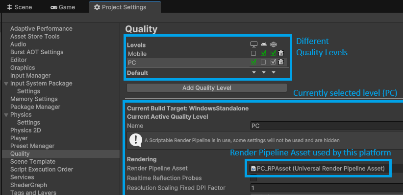
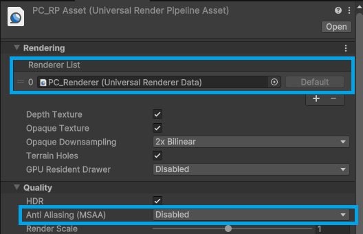
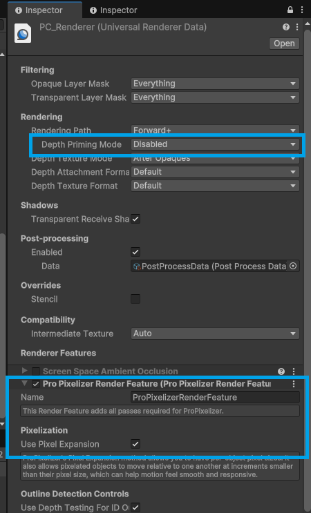

+++
title = "Setup"
description = "Setup"
weight = 2
date= 2024-10-19
+++

Welcome to ProPixelizer, let's get started!

{{ article_toc() }}

## First-time install

### 1. Import ProPixelizer

Add ProPixelizer to your project's Assets folder using Unity's package manager.

### 2. Find your Render Pipeline Asset(s)

Universal Render Pipeline stores your project's graphical configuration in a Render Pipeline Asset.
These assets are commonly stored in Assets/Settings.
Please note that your project very likely has multiple Render Pipeline Assets, and different platforms can use different Render Pipeline Assets.

- At the top of `Project Settings -> Graphics`, the `Default Render Pipeline` defines the default asset.
- The chart at the top of `Project Settings -> Quality` shows different `Levels` and the platforms that use them. Different platforms can define different render pipeline assets here. This is a common source of confusion! **If your build looks different to editor, they probably have different Render Pipeline Assets.**

### 3. Configure your Render Pipeline Asset(s)

You can now add ProPixelizer to each Render Pipeline Asset that you are using.

- Make sure that anti-aliasing is disabled on each Render Pipeline Asset.

- Select the renderer. Make sure that Depth Priming is disabled, and then add ProPixelizer's render feature to the render feature list.

## Upgrading an older version of ProPixelizer

If your project is already using a previous version of ProPixelizer which was imported into your Project's `Assets` folder, **please delete this old version first** and then import the new version using the Unity Package Manager.

ProPixelizer uses the same `.meta` files for all assets and source files between versions and so your project will automatically use the updated scripts, Monobehaviors and assets from the new package version. ProPixelizer materials will automatically detect if updates are required.

 For more detailed update notes and version history, see the [changelog](@/versions/changelog/index.md) and [update guide](@/versions/updating_from_prev/index.md).

## Check out the examples!

You have now configured your project for ProPixelizer.
The [example scenes](../examples) show you lots of interesting things you can do with ProPixelizer, and showcase various features of the plugin, so I recommend taking a look!

I hope you enjoy using ProPixelizer. If you have any issues, please do email me (elliot.bentine@gmail.com), add me on Discord (elliotb256), or contact via the Discord server (see icon in the nav bar) and I will do my best to help.

