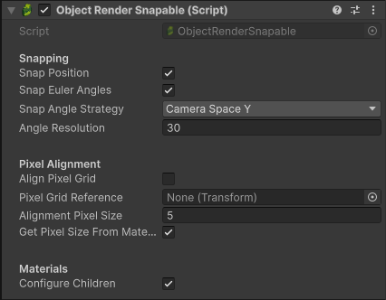
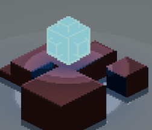

+++
title = "Object Render Snapable"
weight = 21
+++

The `Object Render Snapable` MonoBehavior allows the position of objects to be snapped before rendering the frame. Coupled with a [ProPixelizer Camera](@/technical/propixelizer_camera/index.md) this can be used to [eliminate pixel creep](@/usage/eliminate_pixel_creep/index.md). Snapping of object view angles is also supported, allowing you to easily create the look of hand drawn pixel art which typically restricts the number of view directions. The original positions and angles are restored after camera rendering is complete.

### Snapping

- `Snap Position`: enables or disables snapping of the object's position.
- `Snap Euler Angles`: enables or disables snapping of the object's rotation. A number of different strategies are available:
    - `World Space Rotation`: the euler angles describing the rotation of the object in world space are snapped to the desired `Angle Resolution`.
    - `Camera Space Y`: the euler angles describing the rotation of the object are snapped in world space for x and z, and camera space for the Y-axis. For a camera that rotates freely around the y-axis, this will allow objects to appear with a restricted number of view directions, as shown in the gif below.

### Pixel Alignment

- `Align Pixel Grid`: whether to align an object's macropixels to the given  `Pixel Grid Reference` when applying snapping. This can be used to prevent sub-pixel relative motion between two objects (for more detail on aligning pixel grids, see [here](@/usage/eliminate_pixel_creep/index.md)). This setting is only required if you are using [pixel expansion](@/usage/pixelization/index.md)
- `Alignment Pixel Size`: The size of the macropixel used when snapping an object's position with respect to the given `Pixel Grid Reference`. Normally, you want this property to be equal to your ProPixelizer material pixel size. When `Get Pixel Size From Material` is enabled, this property will be set automatically  by getting the `Pixel size` property from a ProPixelizer material on the object.

### Materials

- `Configure Children`: When true, sets the material keywords required for snapping on all child meshes of this transform.