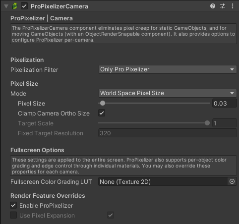

+++
title = "ProPixelizer Camera"
weight = 10
+++

The `ProPixelizerCamera` is a MonoBehavior that should be added to camera objects in your scene. It provides additional control over ProPixelizer's rendering, and performs the position and angle snapping required to [eliminate creep](@/usage/eliminate_pixel_creep/index.md). There are a number of properties available:

### Pixelization

The `Pixelization Filter` controls what objects should be pixelated, allowing you to switch between 'hybrid' styles (where only some objects are pixelated) and full screen pixelization.
- `Full Scene` pixelates the entire scene.
- `Only ProPixelizer` will only pixelate ProPixelizer materials and shaders, including ones you create [using the ShaderGraph SubTarget](@/usage/shadergraph/index.md).

Additionally, when operating with `Full Scene` additional options are available:
- `Use Pixel Art Upscaling` will enable or disable use of a pixel art upscaling filter when blitting the low-res target back to the screen. This can be useful to reduce [shimmer artefacts](@/tips_and_tricks/artefacts/index.md)
- You may choose between a two methods of rendering the low-res target. The `Virtual` camera path is faster, and works by redirecting URP's opaque, transparents and skybox calls into the ProPixelizer low-res target, but may have compatibility issues with other assets. The `Subcamera` path uses a second camera to render the scene at low resolution; it is more widely compatible, but less performant.

### Pixel size

There are several `Mode`s available to determine the pixelization of the low resolution target.
- `World Space Pixel Size` allows you to specify the size of a low-res pixel in world units. This size will be maintained for different camera orthographic sizes and screen resolutions. This is useful for your objects, characters and world to maintain the same apparent pixelization as you freely pan and zoom the view around them.
- `Fixed Downscaling Ratio` defines the low-res target resolution as a fixed multiple of the screen resolution. Note that changes in screen resolution will change the apparent pixelisation of the object.
- `Fixed Target Resolution` allows you to define a fixed height of the low-res target. This is useful if emulating a specific hardware, for example '320p'.

### Fullscreen options

The `Fullscreen Color Grading LUT` allows you to apply color grading and dithering to the entire scene by specifying a color palette LUT. You can use ProPixelizer to create your own. These properties can be specified for individual cameras. _Note: It's still my firm belief that dithering looks better when applied at the object level, so that the dither pattern can move with the object. ProPixelizer now supports both of these approaches, so don't take my word for it - decide for yourself what you like best!_

### Render Feature overrides

These settings can override specific properties of the render feature for each camera, for example to disable ProPixelizer or [pixel expansion](@/usage/pixelization/index.md) for a camera.