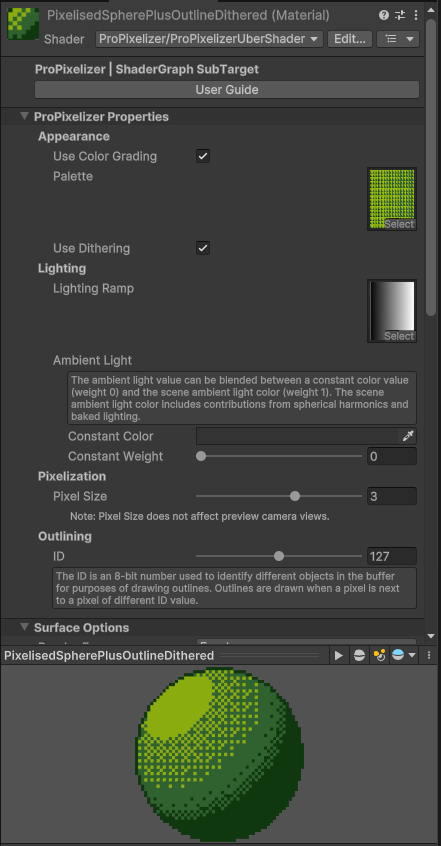

+++
title = "Uber Shader"
weight = 20
+++

The Uber shader is a general purpose object shader provided with ProPixelizer that can be used for a wide variety of visual styles. The shader itself is authored in ShaderGraph using the [ProPixelizer SubTarget](@/usage/shadergraph/index.md), located at `ProPixelizer/ShaderGraph/ProPixelizerUberShader.shadergraph`. Don't forget that you can copy and modify this shadergraph to tweak the shader to your own requirements!

**Note:** _Previous versions of ProPixelizer featured the `PixelizedWithOutline` shader. The Uber shader is a drop-in replacement shader, which has all the features of the old shader while adding many more, eg. Forward+ support, Hybrid renderer support, GPU Instancing. It is recommended to upgrade your `PixelizedWithOutline` materials to the Uber shader._

### ProPixelizer Properties

These properties are present for all [ProPixelizer SubTarget](@/usage/shadergraph/index.md) materials, and control aspects of the cel shading and pixelisation.

**Appearance:**

- `Use Color Grading`: when enabled, the material applies the given `Palette` look-up-table, which allows you to apply color palettes and dithering to your object. The `Palette` texture property is a texture look-up table (LUT) used for the color grading. A number of LUTs to emulate well-known devices (eg NES, PAL, GameBoy) are shipped with ProPixelizer, and ProPixelizer provides tools to [create your own](@/usage/palette_tools/index.md). The LUT can also include color dither patterns as demonstrated here. 
- `Use Dithering`: toggles whether partial alpha (in the range 0 to 1) should be ignored or drawn as dithered transparency.

**Lighting:**

- `Lighting Ramp`: a texture ramp used for cell shading, which helps give a pixel-art aesthetic. When rendering the object, the value of the lit HSV color is used as a coordinate to sample the lighting ramp.
- `Ambient Light`: fine control over ambient lighting conditions. The `Constant Weight` slider can be used to adjust between only using scene ambient light (0), which uses spherical harmonics, and only using the `Constant Color` (1). Some hand-drawn pixel art styles implicitly assume a fixed constant ambient light, so this option provides an ability to fine tune between those styles and 3D pixel art where ambient light can be included in the object shading.

**Pixelization**

- `Pixel size`: Controls the size of one 'macropixel' when `Use Pixel Expansion` is enabled (see more information [here](@/usage/pixelization/index.md)).

**Outline**

- `ID`: A unique integer in the range (0, 255). Outlines are drawn when pixels have an ID different to those around them. If two objects should have outlines when they meet, give them different IDs (eg, two enemies). If they should not have outlines (eg, a character and their equipment), give them the same ID.

### Surface Inputs

These closely match similar properties from the URP Lit shader.

- `Albedo` texture and `Color`: define the base color of the model before lighting calculations, and default to white if unassigned. The alpha channel of the `Albedo` texture is used for alpha clipping.
- `Normal Map`: an optional normal map to add shading detail to the model. In general, I find that cel shading in pixel art tends to work best without normal maps and using smooth shading on models, but there are some situations (eg. scenery) where normal maps can be useful.
- `Emission` texture and `Emission Color`: provide unlit colors for your material. Think laser beams, red eyes on skeletons, etc - anything you want to be bright even when in darkness. The color is an HDR property to support bloom post processing.
- `DiffuseVertexColorWeight` and `EmissiveVertexColorWeight`: these sliders control whether any vertex colors in the mesh should be used to additionally tint the lit and unlit colors of the mesh. Unity's particle system uses vertex color for 'per particle' coloring. Some Synty models have black vertex colors on some mesh areas.
- `Alpha Clip Threshold`: the minimum alpha value of the `Albedo` and `Color` required to draw parts of the mesh.

**Outline properties**, for more information on available outline types see [the outline section](@/usage/outlines/index.md).

- `Outline Color`: the color to use for the silhouette outline, with outline strength controlled by the alpha the alpha value; alpha values of 0 can be used for invisible outlines, 1.0 can be used for block color, and fractions to blend with the unoutlined color.
- `Edge Highlight`: lightens or darken edges detected by inspection of scene normals. Requires that 'Use Normals For Edge Detection' is enabled on the Render Feature. Color values less than 0.5 will darken edges, color values above 0.5 will lighten edges, and values of 0.5 will make no difference.
- `Edge Bevel Weight`: Controls the strength of edge bevelling, which changes the mesh normals along detected edges to enable light-reactive edges.