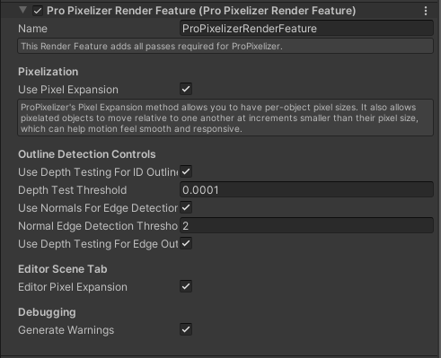

+++
title = "The ProPixelizer Render Feature"
weight = 1
+++

ProPixelizer's Render Feature adds rendering instructions and passes that are required for ProPixelizer to work.
The settings provide additional controls to tweak ProPixelizer to your needs, as described below:

The **Pixelization** group configures the methods ProPixelizer uses to pixelate the scene.

- `Use Pixel Expansion` allows pixelated objects to move with apparent sub-pixel motion relative to one another, without pixel creep. I created the method specifically for ProPixelizer, and an overview of how it works can be found here, under Attempt 3. It requires an additional post-process shader to be applied to the scene, but the smooth sub-pixel motion can make certain games feel more responsive.

The **Outline Detection Controls** configure properties of the outline and edge detection shaders.

- `Use Depth Testing for ID Outlines`: When enabled, outlines will only be drawn for edge pixels that are in front of their neighbors. This helps achieve the feel of a hand-drawn sprite, for which the outline would not change depending on the geometry in front of it. A comparison of the two settings is shown in the image here; take particular notice of the darker outline drawn over the vehicle inside the red box when Depth Test is off.

The Editor Scene Tab gives you options to change the behavior of ProPixelizer in the Editor's Scene tab only.

Debugging allows you to disable warnings generated by ProPixelizer.

