+++
title = "ShaderGraph Support"
weight = 6
slug = "shadergraph"
+++

Do you want to make your own shaders using ProPixelizer? No problem! ProPixelizer v2.0 introduces the `ProPixelizer SubTarget` for ShaderGraph, which lets you author your own pixelated shaders easily within ShaderGraph. You use the SubTarget the same as a URP Lit master node; simply add your surface inputs, and ProPixelizer will handle all pixelisation, dithering, outlining, cel shading and color grading for you.

For more advanced users, the ProPixelizer SubTarget also supports:
- GPU Instancing
- the Hybrid Renderer used by Unity's ECS
- Custom properties

The SubTarget also supports per-pixel outline colors; this lets you do cool things like animated dashed outlines, as shown in the examples below.

## Using the SubTarget

You can configure a ShaderGraph to use the ProPixelizer SubTarget by using the option in the Graph Inspector dialogue from within the ShaderGraph editor.

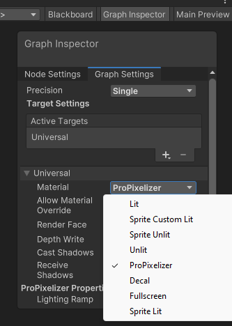

ProPixelizer will automatically add the required material properties, rendering instructions and passes to your shader.

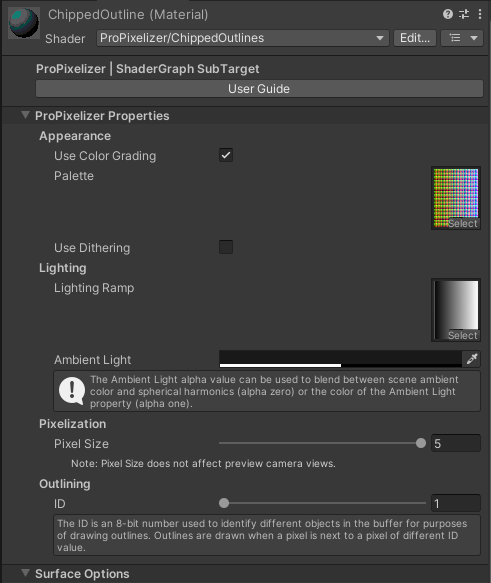

When creating your own graphs, **the only requirement is that you include the ProPixelizer SG Alpha node**, as in the example below.

## Example: Uber Shader

For an example, let's take a look at the `ProPixelizerUberShader`, which is located at `ProPixelizer/ShaderGraph`.

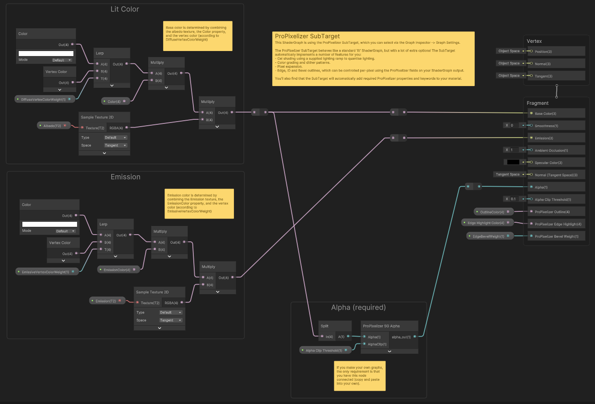

There are two main calculations going on here to determine (i) a lit color, which will receive light; and (ii) an emission color, which is independent of light in the scene.
- The lit color uses the `DiffuseVertexcolorWeight` float parameter to blend between either white or the model's `Vertex color`. The result is multiplied by the `color` property to tint it, and then multiplied again by the `Albedo` texture. This is fed into the `Base color` input of the SubTarget.
- The emission color is similar. We use the `EmissiveVertexcolorWeight` float parameter to blend between white or the model's `Vertex color`. The result is multiplied by the `Emissioncolor`, and then multiplied by the `Emission` texture. This is fed into the `Emission` input of the SubTarget.

## Example: Animated dashed outline

_This example can be found in the Example Assets, under `ShaderGraph`._

As mentioned above, the ProPixelizer SubTarget also gives you _per pixel_ control over edges and outlines. In the following example, we use this to create an animated dashed outline - the sort you might have to indicate a unit is selected in an RTS, for instance.

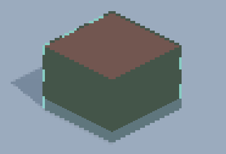

To create the outline, we take the screen position `x` and `y`, multiply them by a constant (to control the line width) and add the results together to give a single number that increases from the bottom left to the top right of the screen. We add `time` to make this number scroll, and use `modulo` to wrap the increasing numbers over the range `[0,1]`. A `step` changes this sawtooth pattern into stripes, which we then use as the input to lerp between two colors for our outline. The final color is fed into the `ProPixelizer Outline` input of the SubTarget.

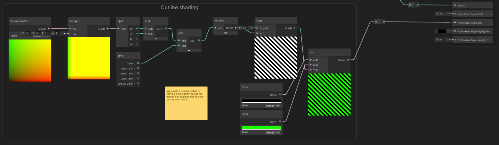

Note that the screenshot above uses color grading, and so the outline color is coerced onto the closest matching color from the color palette. If color palette is disabled, the output looks like the below. Color palettes offer a really neat way to quickly change the look and feel of a project!

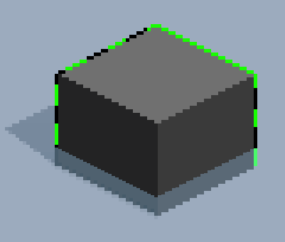

## Example: Prismatic outline

Let's create a multi-colored outline:

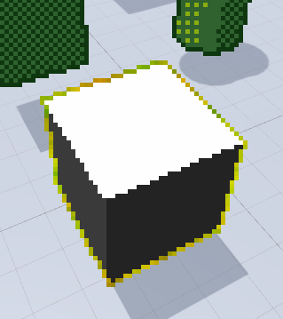

We use the screen coordinates to sample a noise texture, and pass the resulting values into the red and green color channels to create a colorful noisy pattern. Then we plug this color into the `ProPixelizer Outline` color input of the SubTarget.

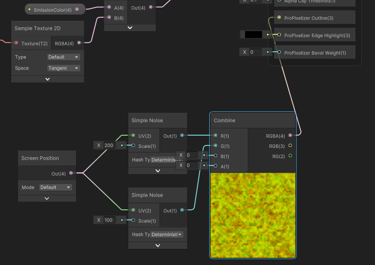

Perhaps you could use this to highlight a particularly rare item in your game?

## Example: World-space 'chips' in bevel edges

_This example can be found in the Example Assets, under `ShaderGraph`._

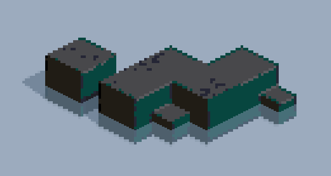

Now let's imagine that we have some old stone ruins, and we want the blocks to be chipped and weathered. We _could_  model this directly in the 3D model, but that makes it difficult to rescale the features (and small features are hard to reliably render when using 3D to pixel art workflows). Furthermore, we want some variation between assets so that each block looks unique.

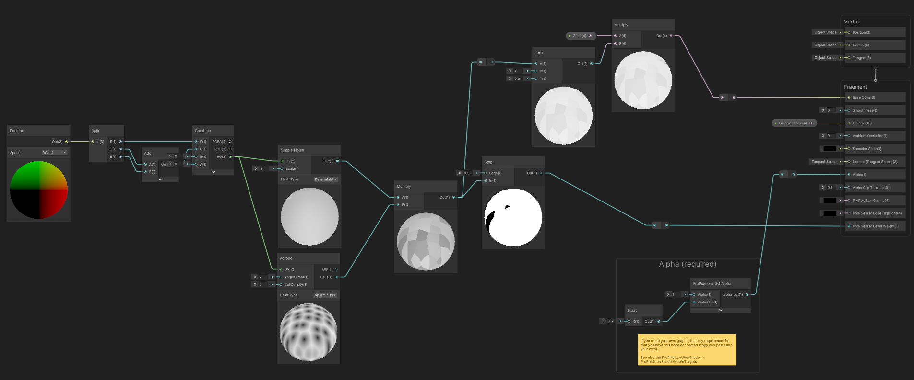

We first take the world space position and combine the `x`, `y`, `z` coordinates to create a UV coordinate that we can use to sample the Simple Noise and Voronoi nodes. Multiplying the results gives us a noisy pattern with hard edges that is spread across the world. We apply a step function to the result, creating faceted black and white areas:

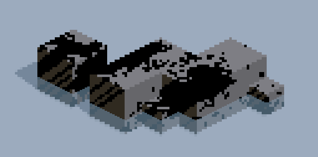

We plug this chip pattern into the `ProPixelizer Bevel Weight` input; this enables the bevel when the chip pattern is white, and disables it where the chip pattern is black. This creates world-space chips in our otherwise perfect 1px bevel lines. We also dilute the chip pattern and direct it to the color node, so that strong weathering will produce a discoloration across the faces that will line up with the bevel chips.

