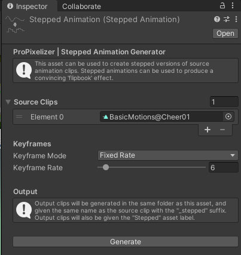

+++
title = "Stepped Animation Tools"
weight = 101
+++

Traditional pixel-art games used hand-drawn sprite sheets, and characters were animated by changing which sprite was displayed - the result was like a 'flipbook', with a few well defined poses. For instance, the cycle for a run animation could be ~5 frames long. 3D animations, on the other hand, commonly interpolate between key frames to produce smooth movement.

To help users achieve a flipbook effect, ProPixelizer provides a utility for automatically converting animation clips into stepped versions. A copy of the animation clip is created, keyframes are decimated, and the interpolation is set to None. This utility allows you to use many standard animations (e.g. from the Asset Store) in a way that keeps the pixel art aesthetic.

To use these tools, create a Stepped Animation asset (Create -> ProPixelizer -> Stepped Animation). After configuring the asset, click 'generate' to create copies of the source clips.

Lastly, if you are using clips with anim trees, you should turn off the blending for the anim tree - otherwise changes of state will interpolate between frames, and break the flipbook feel.