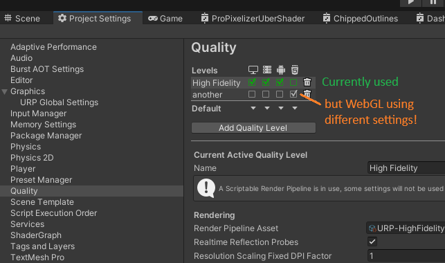

+++
title = "FAQ"
weight = 500
+++

## My object looks like a bunch of dots?

- **Problem:** Pixelated objects appear as a bunch of dots when rendered, as if dithered.
    - **The solution:** The Pixelisation Feature needs to be added to the Render Features of the Scriptable Render Pipeline - see 'Setting Up The Render Pipeline' under 'Getting Started', above.

If you are interested in why it looks like this, you can find the answer in [this](https://medium.com/@elliotbentine/pixelizing-3d-objects-b55ec33328f1) article which describes how ProPixelizer works. The method used for ProPixelizer is described under Attempt #3; objects are first drawn as a dithered matrix of dots, then the post process fills the surrounding screen pixels to produce the final pixelated image.

Note that ProPixelizer also implements dithering for transparency when the materials alpha is not 1 - this applies to both texture and color. If the example scenes are rendering correctly, but your assets are appearing dithered, check that the alpha of your material color and textures.

## ProPixelizer on WebGL

ProPixelizer supports webGL and is tested on all major browsers (Firefox, Chrome).

If you are finding that ProPixelizer is not working on WebGL, **check that you have the ProPixelizer Render Feature added to your render pipeline asset.** By default, Unity will use different render pipeline assets for PC platforms and webGL; if it works in editor and not in build, it's extremely likely that your editor is using a different render pipeline to build.

## The shaders are coming up pink!

This means that the ProPixelizer shaders have not been correctly compiled by Unity. There are typically two possible reasons this occurs:

- In some cases, Unity Package Manager will add the files to the project but not import them correctly.
    - **Solution:** In the project's Asset Browser locate the Packages/ProPixelizer folder and click 'Reimport'.
- In earlier versions of ProPixelizer, the shader graph fails to compile because it is generating too many variants, reporting the error: `Error in Graph at Assets/ProPixelizer/ShaderGraph/Pixelised.shadergraph at node PBR Master: Graph is generating too many variants. Either delete Keywords, reduce Keyword variants or increase the Shader Variant Limit in Preferences > Shader Graph.`
    - **Solution:** This can be fixed by increasing the Shader Variant Limit using Edit > Preferences > Shader Graph, e.g. changing from the default 128 to 256. Afterwards, right click the ProPixelizer folder and reimport, then all should be fine.

