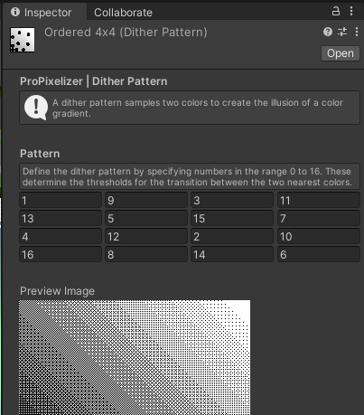

+++
title = "Dither patterns and color palettes"
weight = 100
+++

## Palettes and Dither Patterns

Many old games used reduced color palettes, often due to hardware limitations! For example, the original GameBoy could only display 4 different brightness values, and the SNES could only display 256 colors at once. Games sometimes employed dithering to emulate an increased color depth.

ProPixelizer gives you a set of tools to create reduced color palettes and dither patterns. Both are combined into a texture Look-Up Table (LUT) which is sampled when rendering the object to color grade with minimal overhead.

## Dither patterns

ProPixelizer supports 4x4 dither patterns. You can design your own dither pattern by creating a dither pattern asset (`Create -> ProPixelizer -> Dither Pattern`). The editor will display a 4x4 grid of values, and a preview of how the dither pattern will appear for a smooth monochrome gradient. Each 'value' in the grid ranges from 0 to 16, and shows the 'threshold' at which this pixel in the 4x4 pattern will be enabled. Some example patterns are included (ProPixelizer/Palettes/DitherPatterns).

## Color palettes

You can configure your own palettes using a palette asset (`Create -> ProPixelizer -> Palette`). After configuring the palette, use the 'Generate' button to create a texture LUT that you can use in your ProPixelizer materials.

A number of properties can be configured:
- **Source Texture:** The texture to sample the set of colors from. The text below will tell you how many colors were identified in the source - these are used for color matching when generating the look up table.
- **Color reduction algorithm:** The method to use when deciding which colors are most similar. The comparison can be made in RGB-space, HSV-space, or just using the 'value' of the HSV space (which can work well for monochrome palettes in which hue does not matter).
- **Dithering:** Whether to use a dither pattern.
- **Output:** Options for generated LUT file name.

