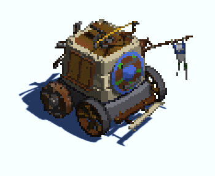

+++
title = "Welcome"
description = "Documentation for the ProPixelizer package"
weight = 1
render = true
+++

Welcome to ProPixelizer's documentation!

- For setting up a new project, see the [Quick Start](@/getting_started/quickstart/index.md) guide.
- Check out the [examples](@/getting_started/examples/index.md) for hands-on demos.
- For a more detailed description of how to use the package, start with the [overview](@/usage/overview/index.md).

I hope you enjoy using ProPixelizer. Please do message me if you have any questions or problems. I'm always very pleased to hear what you make with it!

Cheers,

Elliot